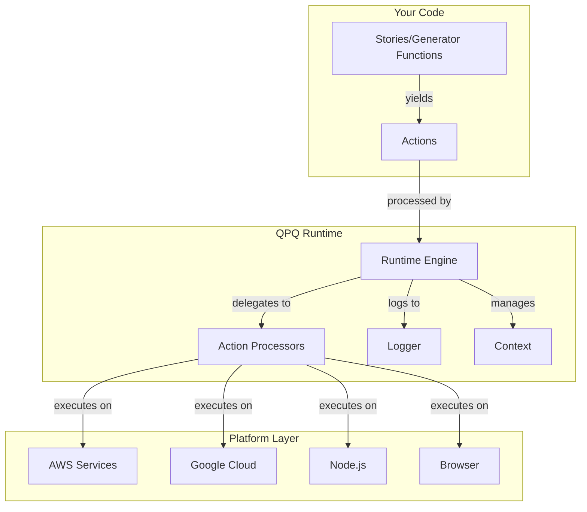

# Architecture Overview

Quidproquo's architecture is built on a few core concepts that work together to provide platform independence, complete observability, and functional composition. Understanding these concepts is key to mastering the framework.

## Core Architecture Components



## The Action/Processor Pattern

At the heart of Quidproquo is the Action/Processor pattern, inspired by Redux but adapted for backend services.

### Actions

Actions are plain JavaScript objects that describe **what** you want to do, not **how** to do it.

```typescript
// Action Definition
interface Action<T> {
  type: string;        // Identifies the action type
  payload?: T;         // Optional data for the action
  returnErrors?: boolean; // Whether to return errors vs throw
}

// Example Action
const readFileAction = {
  type: 'File::ReadTextContents',
  payload: {
    drive: 'user-uploads',
    filepath: 'document.txt'
  }
};
```

**Key Properties of Actions:**
- **Serializable**: Can be converted to/from JSON
- **Deterministic**: Same action always produces same intent
- **Platform-agnostic**: No platform-specific code
- **Testable**: Easy to assert expected actions

### Action Processors

Action Processors are platform-specific functions that know **how** to execute actions.

```typescript
// Action Processor Type
type ActionProcessor<TAction extends Action<any>, TReturn = any> = (
  payload: TAction['payload'],
  session: StorySession,
  actionProcessors: ActionProcessorList,
  logger: QpqLogger,
  updateSession: StorySessionUpdater,
  dynamicModuleLoader: DynamicModuleLoader,
) => AsyncActionProcessorResult<TReturn>;

// Example: AWS S3 Implementation
const awsFileReadProcessor: ActionProcessor<FileReadAction, string> = async (
  payload,
  session,
  actionProcessors,
  logger
) => {
  const s3 = new S3Client();
  const result = await s3.getObject({
    Bucket: mapDriveToS3Bucket(payload.drive),
    Key: payload.filepath
  });
  return [await streamToString(result.Body), undefined];
};

// Example: Local Filesystem Implementation  
const localFileReadProcessor: ActionProcessor<FileReadAction, string> = async (
  payload
) => {
  const filePath = path.join('./storage', payload.drive, payload.filepath);
  const content = await fs.readFile(filePath, 'utf-8');
  return [content, undefined];
};
```

**Action Processor Responsibilities:**
- Execute the platform-specific logic
- Handle errors and return them in a consistent format
- Log execution details
- Update session state if needed
- Coordinate with other processors

### Platform Independence

The same action can have different processors for different platforms:

```typescript
// Your business logic (never changes)
function* readUserDocument(userId: string) {
  const content = yield* askFileReadTextContents('users', `${userId}/profile.json`);
  return JSON.parse(content);
}

// AWS Lambda deployment
const awsProcessors = {
  'File::ReadTextContents': awsS3ReadProcessor
};

// Local development
const localProcessors = {
  'File::ReadTextContents': localFileSystemReadProcessor
};

// Google Cloud deployment
const gcpProcessors = {
  'File::ReadTextContents': gcpStorageReadProcessor
};
```

## Story Composition

Stories are generator functions that compose business logic by yielding actions and receiving results.

### What is a Story?

```typescript
// Story Type Definition
type Story<TArgs extends any[], R> = (...args: TArgs) => Generator<Action<any>, R, any>;

// Example Story
function* createUserStory(email: string, name: string): Generator<any, User, any> {
  // Check if user exists
  const existingUser = yield* askKeyValueStoreGet('users', email);
  if (existingUser) {
    yield* askThrowError('USER_EXISTS', 'User already exists');
  }
  
  // Create user record
  const userId = yield* askGuidNew();
  const user = {
    id: userId,
    email,
    name,
    createdAt: yield* askDateNow()
  };
  
  // Store user
  yield* askKeyValueStoreUpsert('users', user);
  
  // Send welcome email
  yield* askQueueSendMessage('email-queue', {
    type: 'welcome',
    to: email,
    userId
  });
  
  return user;
}
```

### Generator Functions Explained

Generator functions (marked with `function*`) allow us to:

1. **Pause execution** when yielding an action
2. **Resume with the result** when the action completes
3. **Maintain local state** between yields
4. **Compose synchronous-looking** asynchronous code

```typescript
function* exampleStory() {
  console.log('Starting story');
  
  // Yield an action and wait for result
  const result1 = yield { type: 'Action1', payload: 'data' };
  console.log('Got result:', result1);
  
  // Use result in next action
  const result2 = yield { type: 'Action2', payload: result1 };
  
  // Return final value
  return result2;
}
```

### Story Composition Patterns

Stories can call other stories, enabling powerful composition:

```typescript
// Atomic stories
function* validateEmail(email: string) {
  const emailRegex = /^[^\s@]+@[^\s@]+\.[^\s@]+$/;
  if (!emailRegex.test(email)) {
    yield* askThrowError('INVALID_EMAIL', 'Invalid email format');
  }
  return true;
}

function* checkUserExists(email: string) {
  const user = yield* askKeyValueStoreGet('users', email);
  return user !== null;
}

// Composed story
function* registerUser(email: string, password: string) {
  // Reuse validation story
  yield* validateEmail(email);
  
  // Reuse existence check
  const exists = yield* checkUserExists(email);
  if (exists) {
    yield* askThrowError('USER_EXISTS', 'User already registered');
  }
  
  // Continue with registration...
}
```

### Ask Pattern

The `ask*` pattern provides type-safe action creators:

```typescript
// Instead of manually creating actions:
const action = { 
  type: 'File::ReadTextContents', 
  payload: { drive: 'uploads', filepath: 'file.txt' } 
};

// Use ask functions for type safety:
const content = yield* askFileReadTextContents('uploads', 'file.txt');
```

## Runtime Abstraction

The Runtime orchestrates the execution of stories by processing yielded actions through the appropriate processors.

### Runtime Responsibilities

```typescript
const runtime = createRuntime(
  qpqConfig,           // Configuration
  session,             // Current session context
  actionProcessors,    // Platform-specific processors
  getTimeNow,          // Time provider
  logger,              // Logging implementation
  correlation,         // Correlation ID for tracing
  runtimeType,         // Type of runtime (Lambda, Node, etc.)
  dynamicModuleLoader  // Dynamic module loading
);
```

**The Runtime:**
1. **Executes stories** by iterating through yielded actions
2. **Matches actions** to appropriate processors
3. **Manages session** state and context
4. **Logs all operations** with timing and results
5. **Handles errors** consistently
6. **Maintains correlation** for distributed tracing

### Execution Flow

```typescript
// Simplified runtime execution
async function executeStory(story, args) {
  const generator = story(...args);
  let result = generator.next();
  
  while (!result.done) {
    const action = result.value;
    
    // Log the action
    await logger.log({ type: 'ACTION_START', action });
    
    // Find and execute processor
    const processor = actionProcessors[action.type];
    const [actionResult, error] = await processor(action.payload);
    
    // Log the result
    await logger.log({ type: 'ACTION_COMPLETE', result: actionResult, error });
    
    // Continue or throw
    if (error) {
      result = generator.throw(error);
    } else {
      result = generator.next(actionResult);
    }
  }
  
  return result.value;
}
```

### Session Management

The runtime maintains session state throughout execution:

```typescript
interface StorySession {
  correlation?: string;        // Trace ID across services
  depth: number;               // Call stack depth
  accessToken?: string;        // Auth token (not transferred)
  decodedAccessToken?: DecodedAccessToken; // User info
  context: QpqContext<any>;    // Contextual data
}
```

Sessions enable:
- **Authentication propagation** without passing tokens everywhere
- **Correlation tracking** across service boundaries
- **Context sharing** between stories
- **Depth tracking** for recursive calls

## Platform Adapters

Platform adapters bridge the gap between QPQ's abstract actions and concrete platform services.

### Adapter Structure

Each platform adapter package provides:

```typescript
// Package: quidproquo-actionprocessor-aws
export const getAwsActionProcessors = (config: AWSConfig): ActionProcessorList => {
  return {
    // File operations -> S3
    'File::ReadTextContents': createS3ReadProcessor(config),
    'File::WriteTextContents': createS3WriteProcessor(config),
    
    // Key-Value Store -> DynamoDB
    'KeyValueStore::Get': createDynamoDBGetProcessor(config),
    'KeyValueStore::Upsert': createDynamoDBPutProcessor(config),
    
    // Queue -> SQS
    'Queue::SendMessage': createSQSSendProcessor(config),
    
    // User Directory -> Cognito
    'UserDirectory::AuthenticateUser': createCognitoAuthProcessor(config),
    
    // ... more processors
  };
};
```

### Multi-Platform Support

The same story works with different adapters:

```typescript
// Development
const devRuntime = createRuntime(config, session, {
  ...getNodeActionProcessors(),
  ...getLocalFileProcessors(),
  ...getInMemoryKVSProcessors()
});

// Production AWS
const awsRuntime = createRuntime(config, session, {
  ...getAwsActionProcessors(awsConfig)
});

// Production Google Cloud
const gcpRuntime = createRuntime(config, session, {
  ...getGcpActionProcessors(gcpConfig)
});

// The story remains the same
const result = await runtime(myStory, args);
```

### Custom Adapters

Create custom adapters for any platform:

```typescript
// Custom Redis adapter for KeyValueStore
const redisKVSProcessor: ActionProcessor<KVSGetAction, any> = async (payload) => {
  const client = redis.createClient();
  const key = `${payload.storeName}:${payload.key}`;
  const value = await client.get(key);
  return [JSON.parse(value), undefined];
};

// Register custom processor
const customProcessors = {
  'KeyValueStore::Get': redisKVSProcessor
};
```

## Logging and Observability

Every action execution is logged with complete context, enabling powerful debugging and monitoring capabilities.

### Execution Logs

```typescript
interface ExecutionLog {
  correlation: string;      // Unique ID for this execution
  timestamp: string;        // When it occurred
  action: Action<any>;      // What was requested
  result?: any;             // What was returned
  error?: QPQError;         // Any error that occurred
  duration: number;         // How long it took
  session: StorySession;    // Session context
  metadata: {
    stackDepth: number;
    parentCorrelation?: string;
    tags: string[];
  };
}
```

### Log Aggregation

Logs can be aggregated to understand complex flows:

```typescript
// View all actions for a user request
SELECT * FROM logs 
WHERE correlation = 'abc-123' 
ORDER BY timestamp;

// Find slow operations
SELECT action.type, AVG(duration) as avg_duration
FROM logs
GROUP BY action.type
HAVING avg_duration > 1000;

// Trace errors back to root cause
SELECT * FROM logs
WHERE correlation IN (
  SELECT correlation FROM logs 
  WHERE error IS NOT NULL
);
```

### Replay Capability

The complete log enables replay of any execution:

```typescript
// Load execution from logs
const executionLog = await loadExecutionLog('correlation-abc-123');

// Replay with same results
const replayResult = await qpqExecuteLog(
  executionLog,
  originalStory,
  {} // No overrides - exact replay
);

// Replay with modifications for testing
const testResult = await qpqExecuteLog(
  executionLog,
  originalStory,
  {
    // Override specific action to test different scenario
    'KeyValueStore::Get': async () => [null, undefined]
  }
);
```

## Context System

The context system provides a way to share data across story boundaries without passing parameters.

### Context Definition

```typescript
// Define context keys
const userIpContext = createContextKey<string>('user-ip');
const requestIdContext = createContextKey<string>('request-id');
const featureFlagsContext = createContextKey<FeatureFlags>('feature-flags');

// Provide context
function* handleRequest(request: HTTPRequest) {
  yield* askContextProvide(userIpContext, request.ip);
  yield* askContextProvide(requestIdContext, request.id);
  
  // Context is now available to all child stories
  yield* processBusinessLogic();
}

// Consume context
function* auditLog(action: string) {
  const ip = yield* askContextRead(userIpContext);
  const requestId = yield* askContextRead(requestIdContext);
  
  yield* askLogCreate('AUDIT', { action, ip, requestId });
}
```

### Context Propagation

Context automatically propagates through story calls:

```typescript
function* parentStory() {
  yield* askContextProvide('user', { id: '123', name: 'Alice' });
  
  // Context available in child
  yield* childStory();
}

function* childStory() {
  const user = yield* askContextRead('user');
  // user = { id: '123', name: 'Alice' }
  
  // And in grandchild
  yield* grandchildStory();
}
```

## Error Handling

Quidproquo provides consistent error handling across all platforms.

### Error Types

```typescript
interface QPQError {
  errorType: string;     // Error code (e.g., 'NOT_FOUND')
  errorText: string;     // Human-readable message
  errorStack?: string;   // Stack trace for debugging
}

// Throwing errors
yield* askThrowError('VALIDATION_ERROR', 'Email is required');

// Catching errors
const result = yield* askCatch(riskyOperation());
if (!result.success) {
  // Handle error
  console.log('Error:', result.error);
}
```

### Error Propagation

Errors bubble up through the story stack:

```typescript
function* parentStory() {
  try {
    yield* childStory();
  } catch (error) {
    // Handle or rethrow
    yield* askLogCreate('ERROR', error);
    throw error;
  }
}
```

## Performance Considerations

### Action Batching

Reduce overhead by batching related actions:

```typescript
// Instead of multiple yields
for (const item of items) {
  yield* askKeyValueStoreUpsert('items', item);
}

// Batch operations
yield* askBatch(
  items.map(item => askKeyValueStoreUpsert('items', item))
);
```

### Parallel Execution

Execute independent actions in parallel:

```typescript
// Sequential (slower)
const user = yield* askKeyValueStoreGet('users', userId);
const preferences = yield* askKeyValueStoreGet('preferences', userId);
const history = yield* askKeyValueStoreGet('history', userId);

// Parallel (faster)
const [user, preferences, history] = yield* askRunParallel([
  askKeyValueStoreGet('users', userId),
  askKeyValueStoreGet('preferences', userId),
  askKeyValueStoreGet('history', userId)
]);
```

### Lazy Loading

Action processors can be lazy-loaded to reduce cold starts:

```typescript
const getLazyProcessors = (): ActionProcessorList => {
  return new Proxy({}, {
    get: (target, property) => {
      // Load processor only when needed
      if (property === 'File::ReadTextContents') {
        return require('./processors/file').readProcessor;
      }
      // ... other processors
    }
  });
};
```

## Security Model

### Authentication Flow

```typescript
function* authenticatedStory(request: HTTPRequest) {
  // Decode and validate token
  const token = yield* askUserDirectoryDecodeAccessToken(
    request.headers.authorization
  );
  
  // Token available in session for child stories
  // Never passed as parameter
  yield* businessLogic();
}
```

### Authorization

```typescript
function* authorizedAction(resource: string) {
  // Get user from session
  const session = yield* askSessionRead();
  const user = session.decodedAccessToken;
  
  // Check permissions
  const permissions = yield* askKeyValueStoreGet('permissions', user.userId);
  if (!permissions.includes(resource)) {
    yield* askThrowError('FORBIDDEN', 'Access denied');
  }
  
  // Proceed with action
}
```

## Summary

Quidproquo's architecture provides:

1. **Clean separation** between business logic (stories) and infrastructure (processors)
2. **Platform independence** through the action/processor pattern
3. **Complete observability** via comprehensive logging
4. **Functional composition** using generator functions
5. **Consistent patterns** across all services and platforms

This architecture enables you to:
- Write business logic once and deploy anywhere
- Debug production issues with execution replay
- Test complex workflows easily
- Scale from prototype to production
- Migrate between platforms without code changes

The key insight is that by describing **what** you want to do (actions) separately from **how** to do it (processors), you gain unprecedented flexibility and maintainability in your applications.